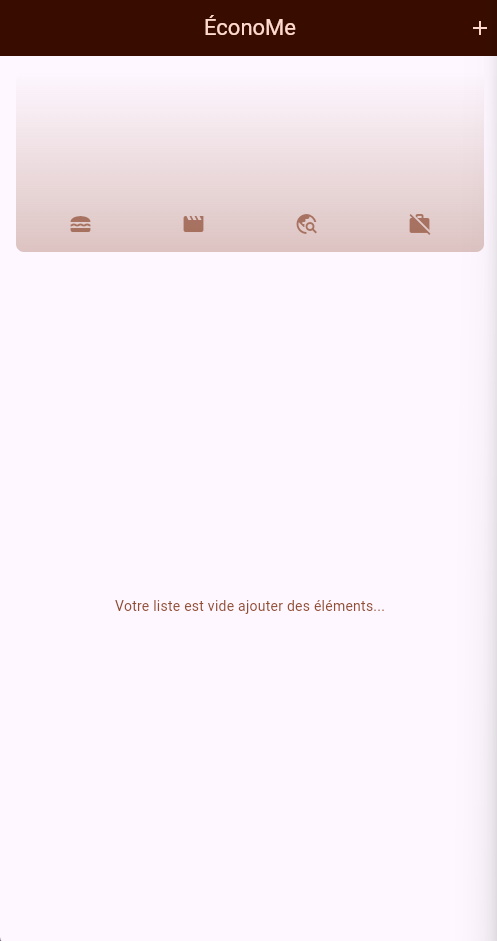
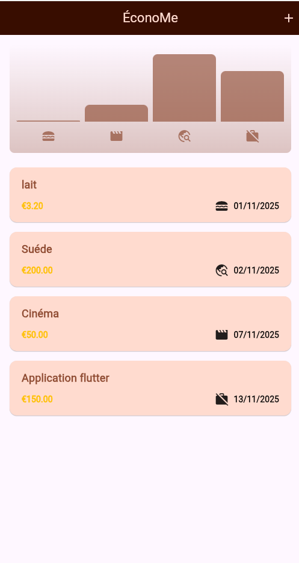
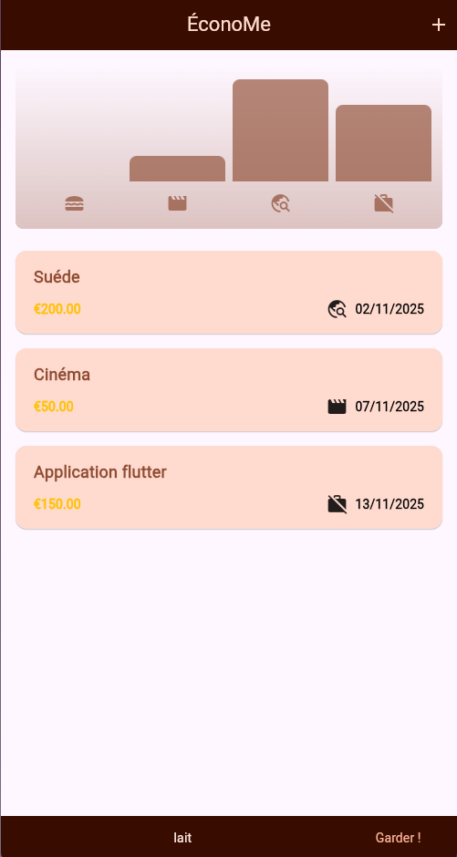

# 📚 Flutter Expense

**Flutter Expense** est une application mobile simple développée avec **Flutter** permettant d’ajouter, afficher et gérer des dépenses.  
L’objectif principal du projet est pédagogique : apprendre et pratiquer Flutter à travers une application concrète, avec formulaires, listes dynamiques et widgets personnalisés.

---

## 🎯 Objectifs du projet

- Pratiquer la création d’interfaces avec **Flutter**
- Comprendre le fonctionnement des **StatefulWidget**
- Manipuler des **listes dynamiques**
- Gérer des **formulaires** (TextField, validation…)
- Ajouter, afficher et supprimer des données
- Structurer un petit projet Flutter proprement

---

## 🧩 Fonctionnalités

- Ajouter une dépense (titre, montant, date)
- Afficher une liste de dépenses
- Supprimer une dépense
- Interface moderne et simple
- Gestion de l’état avec `setState`
- Code clair, lisible et adapté à l’apprentissage

---

## 🛠️ Technologies utilisées

- **Flutter**
- **Dart**
- Widgets **Material**
- Formulaires Flutter (`TextField`, `TextFormField`)
- Gestion d’état simple avec `setState`

---
### Accueil


### Ajouter une dépense


### Liste des dépenses


### Suppression des dépenses


---

## 🧱 Architecture simple du projet


```text
lib/
 ├─ main.dart               # Point d'entrée de l'application
 ├─ models/
 │    └─ expense.dart       # Modèle de données pour une dépense
 ├─ widgets/
 │    ├─ expense_list.dart  # Widget affichant la liste des dépenses
 │    ├─ expense_item.dart  # Widget affichant une dépense
 │    └─ new_expense.dart   # Formulaire pour ajouter une dépense
 └─ screens/
      └─ home_screen.dart   # Écran principal de l'application


